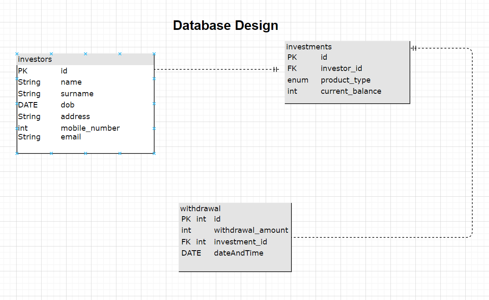

# Investment Management REST API

## Introduction

The Investment Management REST API is a Spring Boot application that exposes a secure REST API for managing investor
information and their investments. It allows consumers to retrieve investor details, list their investments, and create
new withdrawals, subject to specific validation rules.

## Features

### 1. Retrieve Investor Information

* Endpoint: /investors/{id}
* HTTP Method: GET
* Description: Retrieves personal, address, and contact information for a specific investor.

### 2. Retrieve Investor's Investments

* Endpoint: /investments/{{investorId}}
* HTTP Method: GET
* Description: Retrieves a list of products in which the investor has invested. Each product provides a product ID,
  type (RETIREMENT or SAVINGS), name, and current balance.

### 3. Create a New Withdrawal

* Endpoint: /api/withdrawals/do-withdrawal

* HTTP Method: POST

* Description: Creates a new withdrawal for a given product. The following validations are applied:

    * If the product is RETIREMENT, the investor's age must be greater than 65.
    * If the withdrawal amount is greater than the current balance, a validation error is returned.
    * Investors cannot withdraw more than 90% of the current balance.

## Project Initialization

### PostgreSQL Database Initialization

* The Spring Boot application initializes a PostgreSQL database on startup and pre-populates it with investor details,
  including name, surname, date of birth, address, mobile number, and email address.

* Two products are linked to each investor: RETIREMENT with a balance of R500,000 and SAVINGS with a balance of R36,000.

* A migration script is used to pre-populate this data.

## Technologies Used

* Spring Boot: A powerful framework for building Java-based applications.
* PostgreSQL: An open-source relational database management system.
* Maven: A build automation tool for managing project dependencies.

## Installation

To run the Investment Management REST API on your local environment, follow these steps:

1. Clone the repository:

```bash
git clone <https://github.com/nasiphivinqishe/WithdrawalAPI>

```

2. Build the project:

```bash
mvn clean install

```

3. Run the application:

```bash
mvn spring-boot:run

```

The API will be available at http://localhost:8080.

### Tests

* Tests can be run individually or via maven
* Postman
  - [https://interstellar-rocket-658872.postman.co/workspace/New-Team-Workspace~d6d4b415-8e59-47e6-9791-0af240e6a4ca/collection/25238752-95cc839b-c497-44e0-94e8-7a17cefe59cc?action=share&creator=25238752]

## Database Design



## Author

Nasiphi Vinqishe  
nasiphivinqishe@gmail.com
